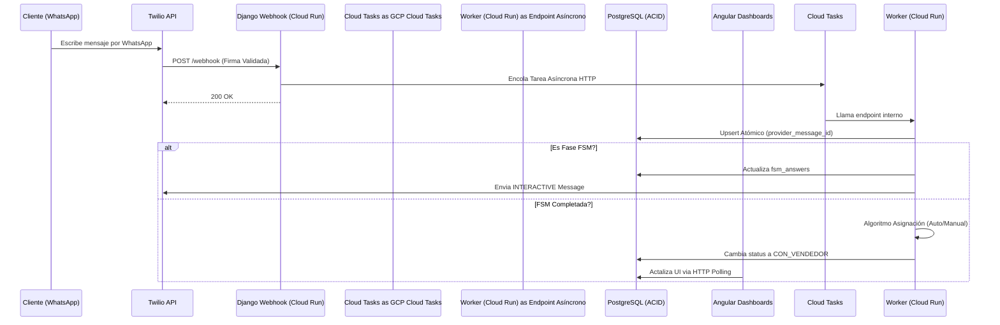

## 🛠️ 1. Stack Tecnológico de Élite y Tooling

* **Backend:** `Django 5.1` (Asincronía nativa).
* **Frontend:** `Angular 18+` (TypeScript estricto), `RxJS` para "Polling" eficiente.
* **Auth:** **OIDC Multi-Issuer (Stateless)**. Soporte simultáneo para **Microsoft Entra ID (Azure AD)** y **Google Workspace (Google Identity)** mediante validación nativa JWT en Django. Prohibido el uso de intermediarios como Firebase Auth.
* **Base de Datos:** `PostgreSQL 15+` (GCP Cloud SQL) con soporte avanzado `JSONB` y RLS.
* **Broker & Caché:** Eliminados (KISS). La asincronía se delega a la capa serverless de GCP.
* **Worker Engine:** `GCP Cloud Tasks` (Encolamiento push) + `GCP Cloud Scheduler` (Cron).
* **Seguridad y Secretos:** **GCP Secret Manager** obligatorio para inyección de configuraciones sensibles (DB, Twilio API Keys, Tokens).
* **Calidad de Código:** `MyPy` para análisis estático de tipado estricto en el backend con Python.
* **Infraestructura & Hosting:** 
    * **Backend:** GCP Cloud Run (Escalado a cero `--min-instances 0` para optimización de costos).
    * **Frontend:** **Firebase Hosting** (Estrictamente y ÚNICAMENTE para servir los archivos estáticos de Angular. No se usarán otros servicios de Firebase).
    * **Storage:** GCP Cloud Storage (Persistencia de Audios/Imágenes).
* **Observabilidad y APM:** Sentry (Performance Tracing) y GCP Cloud Logging (Logs estructurados en formato JSON).

### 🧠 Skills y MCPs del Agente

> **Skills Activas (Obligatorias):** `Clean Architecture`, `High Concurrency`, `Security & Compliance`, `Observability & Monitoring`.
> **MCPs Activos (Permanentes):** `postgresql_mcp` (Validación DDL), `filesystem_mcp` (Escritura de código).

**Skills Contextuales (Activar según la sesión de código):**
* 🧪 **`TDD (Test-Driven Development)`:** Actívala solo cuando le pidas crear el motor de la FSM o el calculador del `urgency_score`.
* 📊 **`SQL Optimization & Database Design`:** Actívala cuando vayas a definir migraciones complejas o transacciones atómicas crtícas en el webhook.
* 🛡️ **`SRE (Site Reliability Engineering) / PRR`:** Actívala estrictamente en la fase de Code Review de los endpoints asíncronos (Cloud Tasks) y Webhooks para cazar fugas de memoria y *Connection Pool Exhaustion*.
* ☁️ **`Cloud DevOps & Infra`:** Actívala al final, cuando vayamos a redactar el `Dockerfile`, el `cloudbuild.yaml` y la configuración de escalado a cero en Cloud Run.

**MCPs Contextuales:**
* 🌐 **`Google Search / web_search_mcp`:** Actívalo solo si la IA necesita validar algún cambio reciente en la Graph API de Meta (v18.0+) o en la documentación de `uv`.
* 🐙 **`github_mcp`:** Para automatizar la creación de PRs (Pull Requests) cuando pases de entorno local a tu repositorio remoto.

### 📦 Gestor de Dependencias y Entorno
> **Uso estricto de `uv`** (reemplazando `pip`, `venv` y `poetry`). Todo el manejo de paquetes se hará mediante `uv add` y `uv sync`. El archivo `uv.lock` es la única fuente de la verdad para los despliegues en producción; queda terminantemente prohibido hacer `pip install` manuales o generar `requirements.txt` ad-hoc.

---

## 🎯 2. Definición del Dominio y Alcance (Scope)

### 🚫 Out of Scope (Restricciones V1)
* **Gestión de Inventario (ERP):** El CCRM no es un sistema de stock. Recibe el interés del modelo, pero no gestiona la carga de vehículos.
* **Pasarela de Pagos:** No procesamos transacciones. El fin es el agendamiento y la calificación, no la venta por e-commerce.
* **Módulo de Marketing masivo:** No es para enviar spam. Es puramente transaccional y conversacional (CCRM).
* **Integración con CRMs Legados:** En la V1, el CCRM es el sistema de registro principal. No se sincroniza con Salesforce/HubSpot aún.
* **Aplicación Móvil o Interfaz Responsiva (Mobile-First):** El Dashboard y la bandeja están optimizados exclusivamente como Web de Escritorio (Desktop Web App). No se construirá versión nativa ni responsiva para celulares en la V1.

### 👤 Historias de Usuario Core

**🗣️ Cliente:**
* Como interesado, quiero iniciar un chat y recibir opciones claras de botones para no tener que escribir texto largo y obtener una respuesta instantánea.

**👔 Gerente:**
* Quiero ver un Leaderboard basado en el Win-Rate real para incentivar la competencia sana entre mi equipo.
* Quiero auditar el `AuditLog` de cualquier sesión para entender por qué se perdió una venta o si hubo mala praxis de un vendedor.
* Quiero cambiar el modo de ruteo de `Manual` a `Auto` (Round-Robin) cuando el equipo esté saturado.
* Quiero acceder a una vista de "Solo Lectura" de cualquier chat activo sin que el vendedor reciba notificaciones de lectura ni el cliente vea un estado de "visto", para supervisar el cumplimiento de los protocolos de venta y el tono de la conversación en tiempo real.

**💼 Vendedor:**
* Quiero ver el historial y las respuestas del bot (modelo, presupuesto) antes de saludar, para no repetir preguntas que el cliente ya contestó.
* Quiero una interfaz fluida (mediante HTTP Polling rápido) para responder mensajes en menos de 10 segundos (Speed to Lead) sin requerir re-cargar la página manualmente.
* Quiero marcar un lead como `Ganado` con un clic para que mi comisión y mi Win-Rate se registren correctamente.

---

## 🔄 3. Arquitectura de Flujo de Datos (Data Flow)

A continuación, el flujo mapeado desde la lógica de negocio hacia la infraestructura asíncrona:

## 🤖 4. Máquina de Estados Finita (FSM - Fricción Cero)

> **Regla de Oro:** El sistema obliga la recolección determinista. Prohibido pedir texto libre para avanzar.
> **Defensa contra Inyección (FSM Edge Case 3):** La FSM solo responde a selecciones de botones o listas interactivas. Si el lead responde con texto libre, audio u otro formato no soportado en ese instante del flujo, el Worker enviará un recordatorio (hasta 3 veces por estado) insistiendo en usar los botones. Esto neutraliza la posibilidad de inyecciones maliciosas y asegura un JSON estructurado para el cálculo de urgencia.

* 📍 **Estado 1: `VEHICLE_TYPE_QUERY`**
  * **Payload a Twilio:** `LIST` message. (Max 10 opciones de carrocería/modelo).
* 📍 **Estado 2: `PAYMENT_METHOD_QUERY`**
  * **Payload a Twilio:** `INTERACTIVE_BUTTONS`. Opciones: `[Contado]`, `[Crédito]`, `[Retoma]`.
* 📍 **Estado 3: `BUDGET_RANGE_QUERY`**
  * **Payload a Twilio:** `LIST` o `INTERACTIVE_BUTTONS` (Rangos predefinidos).
* 📍 **Estado 4: `PURCHASE_INTENT_QUERY`**
  * **Payload a Twilio:** `INTERACTIVE_BUTTONS`. Opciones: `[Hoy]`, `[Esta semana]`, `[Este mes o más]`.

---

## 🗄️ 5. Diseño de Base de Datos y MER (Resumen Conceptual)

* **`Tenant`:** Aislamiento lógico. Almacena `waba_id` y `phone_number_id` obtenidos vía el Onboarding Técnico consultando a la API de Twilio.
* **`Lead`:** Datos del prospecto. `wa_id` (teléfono) debe estar enmascarado en logs (Data Masking).
* **`ChatSession`:** Contiene `fsm_answers`. Índice GIN Obligatorio usando `jsonb_path_ops`. El cálculo del `urgency_score` debe ser un entero con índice B-Tree.
* **`Message`:** Message: Registro inmutable. `provider_message_id` (String, Unique): ID nativo de Twilio (MessageSid).

* **`body`:** (Text): Contiene el texto literal o la URL firmada de GCP Cloud Storage para Audios/Imágenes.
* **`AuditLog`:** Event sourcing parcial. Debe registrar `old_value` y `new_value` en JSONB. Obligatorio para registrar cuando GCP Cloud Scheduler marca sesiones en inactividad de >48h como `PERDIDO_SISTEMA`.
* **`Métricas (Agregación al Vuelo)`:** Debido al volumen transaccional inicial controlado, las métricas de Leaderboard y respuesta se calculan dinámicamente usando el ORM de Django (`annotate()`, `aggregate()`) sobre la tabla `ChatSession` en tiempo real.

---

6. Filtro de Contenido Multimedia: El sistema procesará exclusivamente TEXTO, AUDIO, IMAGEN y DOCUMENTO. Queda prohibido el procesamiento de Stickers, Videos o Ubicaciones en la V1. Si llega un tipo no soportado, se registra el evento como "No soportado" y se activa el fallback de respuesta automática hacia el lead, manteniendo la ChatSession intacta.

---

## 🚧 7. Reglas de Arquitectura Anti-Junior (Rules of Engagement)

1. **Transaccionalidad (ACID) y Prevención de Deadlocks:** 
   * Prohibido usar `get_or_create` en el Webhook. Usa Upsert Atómico (`INSERT ... ON CONFLICT DO NOTHING`) apoyado en el `provider_message_id`. 
   * **Row-Level Locks:** Todo avance de la FSM debe estar dentro de `transaction.atomic()` y ejecutar obligatoriamente `ChatSession.objects.select_for_update().get(id=...)` para bloquear la fila de la sesión en PostgreSQL. Esto previene condiciones de carrera si llegan mensajes del mismo lead en el mismo milisegundo.
2. **Defensa de Payload:** La ausencia del objeto `referral` o la carencia de `text.body` no deben generar excepciones `KeyError` o `NullPointerException`.
3. **Seguridad RLS y Multi-Tenancy:** Todo QuerySet en Django que consuma información de Leads o Mensajes DEBE utilizar un Custom Manager que inyecte `WHERE tenant_id = X` automáticamente.
4. **Inmutabilidad y Auditoría:** Prohibidos los comandos `DELETE` físicos en `Lead` o `ChatSession`. Uso estricto de Soft-Delete (`is_deleted=True`). Prohibido mantener plantillas HSM hardcodeadas; deben sincronizarse vía tarea periódica (Cloud Scheduler).
5. **Optimización ORM:** Prohibidas las consultas N+1 en la bandeja de vendedores; uso estricto de `select_related('lead')`.
6. **Filtro de Contenido:** El sistema es agnóstico al contenido no soportado. Si llega un message_type no admitido (ej. Sticker), el backend debe interceptarlo antes de la FSM, guardar el registro como "No soportado" y disparar la notificación de fallback al lead sin interrumpir el estado de la sesión.
7. **Migraciones "Zero-Downtime":** Queda estrictamente prohibido renombrar columnas o añadir columnas con `DEFAULT` en tablas transaccionales masivas (`ChatSession`, `Message`, `AuditLog`) que provoquen bloqueos (table locks). Se exige usar el patrón `Add -> Backfill -> Drop` en pull requests separados.

---

## ⚠️ 8. Trade-Offs & Edge Cases Oficiales

> 💸 **Trade-off de Costos vs Latencia:** Para el servicio de Ingesta (Webhook) en GCP Cloud Run, operaremos en modo Escalado a Cero (`--min-instances 0`) (Principio YAGNI) limitando la facturación base. Asumimos una mínima penalización de "Cold Start" (aprox 2 seg con Uvicorn) en la recepción del primer mensaje tras un periodo largo de inactividad, que es tolerado nativamente por la política de reintentos de Twilio.

> 🧩 **Edge Case de Estructura Dinámica:** Si Twilio cambia el payload de los mensajes interactivos y el Webhook recibe una llave inesperada, el sistema la atrapará sin fallar (Evitar Error 500) devolviendo un error de API estándar (`{"error": "internal_error"}`) y guardará el error estructurado asíncronamente en Sentry/GCP Logging.

> 🔐 **Edge Case 1: Rotación Silenciosa de Llaves JWKS (Multi-Issuer):** Elegimos validación de identidad OIDC stateless por escalabilidad absoluta. El trade-off es que proveedores como Microsoft y Google rotan sus llaves JWKS periódicamente sin previo aviso. Si la firma del JWT falla por `kid` no encontrado, el middleware de Django **debe identificar el emisor (`iss`), invalidar su caché interna en memoria correspondiente, hacer un re-fetch silencioso de las llaves al emisor específico y reintentar la validación 1 vez** antes de generar el error 401 Unauthorized.

> ⛈️ **Edge Case 2: The "Thundering Herd" en Webhooks:** Si un prospecto envía 4 mensajes muy rápidos hacia una infraestructura Cloud Run escalada a 0, Twilio disparará 4 instancias paralelas intentando crear la misma `ChatSession`. Para resolver esto sin Redis, nos apoyaremos nativamente en la base de datos PostgreSQL mediante un `UniqueConstraint` parcial en `ChatSession`: un `lead_id` solo puede tener garantizada UNA sesión si el estado no es terminal. Los contenedores perdedores de la carrera atraparán el `IntegrityError` y buscarán la sesión recién creada.

---

## 🗃️ 9. Diseño de Base de Datos y Modelo Entidad-Relación (MER) Completo

### 🏢 9.1 Entidades de Estructura y Multi-Tenancy

**`Tenant` (Automotora)**
*La raíz de aislamiento de datos y configuración del negocio.*
* `id` (UUID, Primary Key)
* `nombre_legal` (String, MaxLength 255)
* `rut_empresa` (String, Unique, MaxLength 20)
* `phone_number_id` (String, Unique, MaxLength 50) - Requerido para Twilio API.
* `waba_id` (String, Unique, B-Tree Indexed, MaxLength 50) - Identificador WABA.
* `routing_mode` (Enum: MANUAL, AUTO) - Default: `MANUAL`.
* `is_verified` (Boolean) - Default: `False`.
* `created_at` (Timestamp)

**`User` (Operadores de la Plataforma)**
*Implementación del RBAC y Auth corporativa.*
* `id` (UUID, Primary Key)
* `tenant_id` (Foreign Key -> Tenant.id, Indexed)
* `oidc_sub` (String, Unique, MaxLength 128) - Mapeo agnóstico OIDC (Subject/Object ID) con Azure AD o Google.
* `oidc_issuer` (String, Indexed, MaxLength 100) - Identifica el origen corporativo (`sts.windows.net` o `accounts.google.com`).
* `role` (Enum: ADMIN, MANAGER, SALESPERSON)
* `email` (String, Unique, MaxLength 255)
* `is_active` (Boolean) - Default: `True`.

### 💸 9.2 Entidades Transaccionales (El Motor de Ventas)

**`Lead` (Cliente Potencial)**
*Identidad del prospecto con privacidad garantizada.*
* `id` (UUID, Primary Key)
* `tenant_id` (Foreign Key -> Tenant.id, Indexed)
* `wa_id_hash` (String, Unique, Indexed, MaxLength 64) - Hash SHA-256 para búsqueda O(1) en Webhooks.
* `wa_id` (String, Unique) - ID de WhatsApp en texto plano (Principio KISS para V1).
* `first_name` (String, MaxLength 255, Nullable)
* `last_interaction` (Timestamp)
* `is_deleted` (Boolean) - Soft-Delete. Default: `False`.

**`ChatSession` (El Embudo)**
*La entidad más pesada. Contiene la FSM y el triage.*
* `id` (UUID, Primary Key)
* `tenant_id` (Foreign Key -> Tenant.id, Indexed)
* `lead_id` (Foreign Key -> Lead.id, Indexed)
* `salesperson_id` (Foreign Key -> User.id, Nullable, Indexed) - `NULL` cuando pertenece al bot.
* `status` (Enum: BOT, PENDING_ASSIGNMENT, CON_VENDEDOR, GANADO, PERDIDO_SISTEMA, ABANDONO_BOT)
* `fsm_answers` (JSONB, GIN Indexed via jsonb_path_ops) - La "Ficha del Cliente" estructurada. Default: `{}`.
* `urgency_score` (Integer, B-Tree Indexed, Nullable) - Ordenamiento rápido de dashboard.
* `last_fsm_step` (String, MaxLength 50, Nullable)
* `last_client_message_at` (Timestamp) - Control del TTL de 24 horas de Twilio.
* `lost_reason` (String, MaxLength 255, Nullable)
* `created_at` (Timestamp)
* `updated_at` (Timestamp)
* `is_deleted` (Boolean) - Soft-Delete. Default: `False`.

### 💬 9.3 Entidades de Comunicación y Trazabilidad

**`Message` (Historial de Chat)**
*El registro inmutable de la conversación.*
* `id` (UUID, Primary Key)
* `tenant_id` (Foreign Key -> Tenant.id, Indexed)
* `session_id` (Foreign Key -> ChatSession.id, Indexed)
* `provider_message_id` (String, Unique, MaxLength 255)
* `direction` (Enum: INBOUND, OUTBOUND)
* `message_type` (Enum: TEXT, IMAGE, AUDIO, DOCUMENTO)
* `body` (Text) - Si es texto, guarda el string literal. Si es archivo, guarda la URL de GCP Cloud Storage.
* `created_at` (Timestamp)

**`AuditLog` (Telemetría y Anti-Fraude)**
*Inmutabilidad para gamificación y control gerencial.*
* `id` (BigInt, Primary Key, Auto-incremental)
* `tenant_id` (Foreign Key -> Tenant.id, Indexed) - Obligatorio para RLS.
* `session_id` (Foreign Key -> ChatSession.id, Indexed)
* `actor_id` (Foreign Key -> User.id, Nullable, Indexed) - Humano o Bot.
* `action` (String, MaxLength 100)
* `old_value` (JSONB)
* `new_value` (JSONB)
* `owner_at_time_of_close` (Foreign Key -> User.id, Nullable)
* `created_at` (Timestamp)

---

## 🛡️ 10. Criterios de Producción (Site Reliability Engineering - SRE)

Todo código generado debe cumplir con las siguientes defensas Anti-Caídas:

1. **Prevención de Connection Pool Exhaustion:**
   * Las transacciones de base de datos (`transaction.atomic()`) deben ser lo más cortas posible. Prohibido hacer llamadas HTTP de red (ej. llamar a la API de Twilio) *dentro* de un bloque atómico. Primero resuelves la DB, luego llamas a la red, o viceversa.
   * *Configuración Django:* Se delegará el manejo nativo del pooling de conexiones al parámetro `CONN_MAX_AGE` de Django en conjunto con `Cloud SQL Auth Proxy`, evitando infraestructuras intermedias innecesarias para la concurrencia inicial esperada.
2. **Ausencia Absoluta de Procesos de Larga Vida (Worker Leaks):**
   * Al eliminar Celery y pasar a GCP Cloud Tasks, eliminamos la clase entera de bugs por *Memory Leaks* en los workers asíncronos. Todo proceso HTTP en Cloud Run nace, atiende la petición despachada por Cloud Tasks, y muere.
3. **Defensa contra Timeouts Externos (Twilio API):**
   * Queda estrictamente prohibido usar la librería `requests` o `httpx` sin un parámetro de `timeout` explícito. Si Twilio se cae y no hay timeout, las instancias de Cloud Run quedarán saturadas esperando. Timeout máximo permitido: `5 segundos`.
4. **Resiliencia Automática Nivel 7 (Serverless):**
   * Al apoyarnos en **GCP Cloud Tasks**, el sistema gana Dead Letter Queue (DLQ) nativo sin infraestructura extra. Si la API de Twilio devuelve siempre un 400 por un número inválido o 500 intermitente, Cloud Tasks ejecutará reintentos exponenciales automáticos ('at-least-once delivery'). No programaremos lógica manual de reintentos en Django.
5. **Observabilidad Proactiva y Alert Routing:**
   * **Playbooks de Alertas:** Si la tasa de webhooks fallidos (HTTP 500s) supera el 1% o hay picos de tareas fallidas en Cloud Tasks, el sistema debe disparar una alerta P1 a través de **Sentry** y **GCP Cloud Logging** directamente a canales específicos (Slack, Teams, etc) para el equipo de guardia.
   * **Healthchecks Obligatorios:** Configurar explícitamente los endpoints `/health/liveness` (para asegurar que la instancia de Django arrancó) y `/health/readiness` (que verifique conexión real a PostgreSQL). Fundamental para que GCP Cloud Run enrute el tráfico correctamente y aísle instancias rotas.
6. **Seguridad en Reposo Estricta (Data-at-Rest):**
   * Como se ha decidido mantener el `wa_id` y otros metadatos sin cifrado a nivel de aplicación (para facilitar debugging), es un requerimiento inviolable que **la base de datos PostgreSQL completa (GCP Cloud SQL) tenga habilitado el encriptamiento nativo AES-256 en reposo gestionado por Google**. Además de enmascarar obligatoriamente la PII en Sentry/Logs.

---

## 🚀 11. Estrategia de Entornos y Despliegue (CI/CD)

El desarrollo utilizará un flujo de promoción simplificado apoyado **estrictamente en contenedores (Docker)**.

* 💻 **Local (Development):**
   * **Todo el entorno debe estar contenido en Docker (`docker-compose.yml`).** Incluyendo PostgreSQL y el servidor web Django. Prohibido requerir la instalación de binarios locales distintos a Docker y `uv`.
   * Webhooks y Cloud Tasks Mocking: Expuestos vía `Ngrok` o ejecutados de forma síncrona en local (`TASK_ALWAYS_EAGER=True` o equivalente).
* 🌟 **Production (Main) con Blue/Green Nativo:**
   * Dada la fuerte cobertura estática y de tests unitarios (MyPy/Pytest), no se mantendrá un clon perpetuo de Staging para ahorrar costos.
   * La instancia principal de Base de Datos es inmutable.
   * **Despliegues Canarios:** Cuando se apruebe un PR, la imagen Docker se despliega en GCP Cloud Run apuntando un **0% del tráfico** hacia ella (Revision Tagging) para pruebas internas de QA. Una vez validada, se promueve al 100%.
   * Ejecución estrictamente a través de imagen Docker inmutable compilada en el CI/CD (`Dockerfile` multiphase basado en alpine/slim).
   * **Frontend Stack:** Construido en **Angular 18+**.
   * **Despliegue del Frontend:** Alojamiento estático en **Firebase Hosting** (Solo como file server). Esto garantiza extrema velocidad de despliegue, aprovisionamiento gratuito de SSL y CDN Global inmediato, evadiendo la complejidad de balanceadores de carga TCP/HTTPS en V1.
   * Backend: **GCP Cloud Run**.
   * Autenticación: **OIDC Corporativo (Microsoft Entra ID / Google Workspace)**.
   * Base de Datos: Cloud SQL con backups automatizados.
   * Conexión: WABA ID real y número certificado.

---

## 🧪 12. Estándares de Testing (Quality Assurance)

* **Framework Obligatorio:** Uso estricto de `pytest`, `pytest-django`, y `pytest-asyncio`. Prohibido usar el módulo `unittest` nativo de Django.
* **Aislamiento de Red:** Queda terminantemente prohibido hacer llamadas HTTP reales a Twilio en los tests. Todo envío de HSM o mensajes interactivos debe estar interceptado mediante `unittest.mock.patch` o `responses`.
* **Tests Transaccionales:** Los tests de ingesta (Webhook) deben validar que un error lance un Rollback y no deje datos huérfanos en `ChatSession`.
* **Cobertura Crítica:** El Módulo B (FSM) y el Módulo C (Enrutamiento) exigen un **90% de cobertura**.

## 13. Out of Scope (Lo que NO hace el software)

* **Gestión de Inventario (ERP):** El CCRM no es un sistema de stock. Recibe el interés del modelo mediante la FSM, pero no gestiona la carga, edición o disponibilidad física de vehículos.
* **Pasarela de Pagos:** El sistema no procesa transacciones financieras, depósitos ni reservas. El objetivo es el agendamiento y la calificación cualitativa, no la venta por e-commerce.
* **Módulo de Marketing Masivo:** El sistema no está diseñado para campañas de envío de spam o boletines. Su naturaleza es puramente transaccional y conversacional (CCRM) basada en eventos de entrada.
* **Integración con CRMs Legados:** El CCRM actúa como el sistema de registro (System of Record) principal. No se contempla la sincronización bidireccional con plataformas como Salesforce o HubSpot en esta fase.
* **Aplicación Móvil o Interfaz Responsiva (Mobile-First):** El Dashboard gerencial y la bandeja de chat para vendedores están diseñados y optimizados exclusivamente como una **Aplicación Web de Escritorio (Desktop Web App)**. 
    * *Restricción Técnica:* No se construirá una versión nativa para iOS/Android.
    * *Protocolo Operativo:* No se adaptará la interfaz para ser operada desde pantallas móviles. El flujo de trabajo de ventas debe realizarse estrictamente desde una estación de trabajo (PC/Laptop) para garantizar la correcta visualización de la ficha del cliente (fsm_answers).

---

## 🔐 14. Protocolo de Identidad y Seguridad (OIDC/JWT)

Para una arquitectura de identidad impecable, el sistema implementa los siguientes pilares técnicos:

1.  **Diferenciación entre Autenticación y Autorización:**
    *   **Autenticación (OIDC):** Identifica al usuario ("quién es").
    *   **Autorización (RBAC Interno):** Determina permisos sobre recursos ("qué puede hacer").
2.  **El Token de Identidad (ID Token/Access Token):** Al completar el login, el sistema recibe un JWT autoportante firmado digitalmente por Google o Microsoft. La identidad se valida estrictamente sin consultar la base de datos en cada petición.
3.  **Autenticación Stateless (Multi-Issuer):** El backend extrae el claim `iss` (Issuer) del header del JWT sin verificarlo aún. En base al `iss`, el middleware decide contra qué JWKS oficial (Microsoft o Google) validará la criptografía de la firma `kid`.
4.  **Anatomía del JWT (Header, Payload, Signature):**
    *   **Header:** Algoritmo de encriptación y `kid` (Key ID).
    *   **Payload:** Claims del usuario (email, sub/oid, iss).
    *   **Signature:** Garantía de no manipulación vericada contra JWKS externos.
5.  **Ciclo de Vida (Access vs. Refresh Tokens):**
    *   **Access Token:** Corta duración (~60 min) para autorizar llamadas a la API.
    *   **Refresh Token:** Larga duración, almacenado de forma segura para renovar Access Tokens sin re-login.
6.  **Claims y Scopes:** Solicitud de scopes `openid`, `profile` y `email`. El claim crítico `tid` vincula al usuario inequívocamente con su organización (`Tenant`).
7.  **Validación en Backend (Handshake Obligatorio):** Cada token debe verificarse contra:
    *   **Issuer (iss):** Origen comprobado (Google o Microsoft).
    *   **Audience (aud):** Emitido específicamente para el Client ID de tu App corporativa en Google o Azure.
    *   **Expiration (exp):** Validez temporal vigente en Unix time.